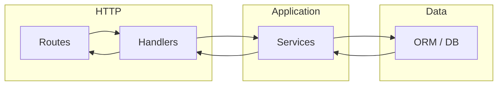

# 📋 General Architectural Decision Records

## Table of Contents

- [Overview](#overview)
- [Purpose](#purpose)
- [ADR Format](#adr-format)
- [Decisions](#decisions)

## Overview

This document serves as a central index and summary of all architectural decisions made during the development of the Node.js ORM R&D project. Each decision is recorded to maintain transparency, facilitate knowledge sharing, and provide context for future development and maintenance.

## Purpose

The goal of this research project is to compare Node.js ORMs and evaluate real-world trade-offs in:

- **Complexity**: Developer experience, learning curve, and code maintainability
- **Performance**: Query efficiency, connection pooling, and resource utilization
- **Maintainability**: Type safety, migration systems, and long-term sustainability
- **Architecture Suitability**: Compatibility with serverless and traditional architectures

This ADR document captures key decisions that shape the research methodology, implementation approach, and evaluation criteria.

## ADR Format

Each architectural decision record follows this structure:

- **Context**: The issue or requirement motivating the decision
- **Decision**: The change or approach being proposed
- **Consequences**: The resulting context after applying the decision (both positive and negative)
- **Implementation Notes**: If they apply.

## Decisions

- [ADR-001: Lightweight Monorepo Structure with Per-ORM Package Isolation](#adr-001)
- [ADR-002: Multiple Independent Services with Per-ORM Docker Setup](#adr-002)
- [ADR-003: Layered API Architecture for ORM Services](#adr-003)

### <a id="adr-001"></a>📦 ADR-001: Lightweight Monorepo Structure with Per-ORM Package Isolation (2026-01-14)

#### 1️⃣ Context

When comparing multiple ORMs in a single research project, we need to decide on a code organization strategy that allows fair evaluation while maintaining clarity and isolation between different implementations. The main challenges are:

- Each ORM has its own dependencies and configuration requirements
- We need to ensure each ORM implementation is tested under comparable conditions
- The project should be easy to navigate and understand
- Dependencies from one ORM shouldn't interfere with another's evaluation

#### 2️⃣ Decision

We will use a **lightweight monorepo structure** with:

- A root `package.json` for shared tooling and scripts
- Individual `package.json` files for each ORM implementation
- Separate directories for each ORM under evaluation

#### 3️⃣ Consequences

##### Positive ✅

- **Clear architectural boundaries**: Each ORM's implementation is self-contained and easy to locate
- **Less magic**: No hidden configurations or complex build orchestration—what you see is what you get
- **Independent versioning**: Each ORM can use its preferred/required versions without conflicts
- **Easier onboarding**: Contributors can focus on one ORM at a time without understanding the entire project
- **Better reproducibility**: Clear dependency trees per ORM make benchmarks more trustworthy

##### Negative ⚠️

- **More folders**: Additional directory structure compared to a flat layout
- **Potential duplication**: Shared utilities or types might need to be duplicated or extracted to a common package
- **Slightly more setup**: Need to configure workspace in root `package.json`

##### Neutral 🔄

- Requires understanding of npm/pnpm workspaces (industry-standard knowledge)
- More `package.json` files to maintain (but each is focused and minimal)

#### 4️⃣ Implementation Notes

- Use `pnpm` workspaces for efficient disk usage and strict dependency isolation
- Root `package.json` should contain only shared dev tools (TypeScript, testing, linting)
- Each ORM package should include its own test suite using the same test scenarios

### <a id="adr-002"></a>📦 ADR-002: Multiple Independent Services with Per-ORM Docker Setup (2026-01-14)

#### 1️⃣ Context

With multiple ORM implementations isolated in separate packages, we need a way to expose and test each ORM's capabilities. The main considerations are:

- Each ORM implementation needs to be accessible for benchmarking and testing
- We want to maintain a consistent API surface across different ORMs for fair comparison
- Each ORM should have complete isolation, including its own database instance
- Services should be independently deployable and scalable
- Each ORM's configuration should remain isolated in its respective package
- We need true process isolation to accurately measure resource usage and performance

#### 2️⃣ Decision

We will implement **multiple independent Fastify services**, one for each ORM, with the following structure:

- Each ORM package contains a `service/` directory with its own Fastify API
- Each service runs on its own port (e.g., Prisma on 4001, TypeORM on 4002, Sequelize on 4003, Drizzle on 4004)
- Each package has its own `docker-compose.yaml` that creates a dedicated Postgres database
- Each package has its own `docker/init/` directory with initialization scripts for its database
- Services are completely independent and can be started/stopped individually
- Each service connects to its own isolated Postgres instance

#### 3️⃣ Consequences

##### Positive ✅

- **True isolation**: Each ORM runs in its own process with its own database, enabling accurate resource measurement
- **Independent deployment**: Services can be deployed, scaled, and updated independently
- **No resource contention**: Each service has its own memory space, connection pools, and database connections
- **Clear boundaries**: Each ORM package is completely self-contained with its own service and database
- **Realistic benchmarking**: Each ORM operates under conditions that mirror real-world microservice deployments
- **Fault isolation**: If one service crashes, others remain operational
- **Independent scaling**: Each service can be scaled based on its specific performance characteristics

##### Negative ⚠️

- **More infrastructure**: Multiple services, multiple databases, multiple ports to manage
- **Increased orchestration complexity**: Need to start/stop multiple services and databases
- **More resource usage**: Each service requires its own process and database instance
- **Port management**: Need to coordinate ports across services
- **More complex local development**: Developers need to manage multiple services and databases

##### Neutral 🔄

- Requires understanding of multi-service architecture (common in microservices)
- Root-level scripts help manage the complexity of multiple services
- Each service can be developed and tested independently

#### 4️⃣ Implementation Notes

- Each package structure: `packages/{orm}/service/` for the API, `packages/{orm}/docker-compose.yaml` for the database
- Root `package.json` includes scripts like `dev:prisma`, `dev:typeorm`, etc. to start individual services
- Each service uses Fastify and follows the same API structure for consistency
- Database initialization scripts create a single database per service (e.g., `movies_prisma`, `movies_typeorm`)
- Each docker-compose uses unique container names, ports, and volume names to avoid conflicts
- Services can be run individually or all together depending on testing needs

### <a id="adr-003"></a>📦 ADR-003: Layered API Architecture for ORM Services (2026-01-29)

#### 1️⃣ Context

Each ORM service (e.g. Prisma) exposes an API to manage the audiovisual catalog domain. We need a consistent structure for routes, HTTP handling, business logic, and data access that:

- Keeps a clear dependency direction (HTTP layer does not call the database directly)
- Makes services easy to unit test by mocking the ORM
- Aligns with common Node/Fastify patterns and is easy to onboard
- Applies to any ORM package in the monorepo

#### 2️⃣ Decision

We will use a **layered architecture** for each ORM service API:

- **Routes** — Define HTTP methods and paths; register handlers.
- **Handlers (controllers)** — Parse and validate the request, call services, format and send the response.
- **Services** — Contain business logic and are the only layer that uses the ORM (e.g. Prisma).
- **Lib** — Shared infrastructure (e.g. ORM client singleton).

Request flow is one-way: **Route → Handler → Service → ORM/DB**. Handlers never import the ORM.

#### 3️⃣ Request Flow



Simplified sequence:

1. **Route** matches method and path, invokes the **handler**.
2. **Handler** reads params/query/body, optionally resolves tenant (e.g. `organizationId` from path or header), calls the **service**.
3. **Service** applies business rules and uses the **ORM** for all reads/writes.
4. **Service** returns a result (or throws); **handler** maps it to status code and response body.

#### 4️⃣ Folder Structure

Each ORM service under `packages/{orm}/service/src/` follows this layout:

```
packages/{orm}/service/src/
├── index.ts              # App bootstrap: Fastify, plugins, route registration
├── lib/
│   └── prisma.ts         # ORM client singleton (e.g. PrismaClient)
├── routes/
│   ├── index.ts          # Aggregates and registers all route modules
│   ├── organizations.ts  # GET/POST/PATCH/DELETE /organizations
│   ├── movies.ts         # e.g. /organizations/:orgId/movies
│   ├── users.ts
│   └── ...
├── handlers/
│   ├── organizations.ts  # listOrganizations, getOrganization, createOrganization, ...
│   ├── movies.ts
│   └── ...
├── services/
│   ├── organization.service.ts  # Business logic + ORM calls only
│   ├── movie.service.ts
│   └── ...
└── middleware/           # Optional: tenant resolution, error handling (no auth in mock)
    └── tenant.ts         # e.g. set organizationId from path or header
```

**Folder roles:**

| Folder            | Responsibility                                                                                                                                               |
| ----------------- | ------------------------------------------------------------------------------------------------------------------------------------------------------------ |
| **`index.ts`**    | Creates the Fastify app, registers plugins and routes, starts the server. No business logic.                                                                 |
| **`lib/`**        | Shared infrastructure. Typically a single file that instantiates and exports the ORM client (e.g. Prisma) so the rest of the app uses one instance.          |
| **`routes/`**     | Declares HTTP surface: method, path, and which handler to call. May attach validation (e.g. schema) or middleware. Does not call services or ORM directly.   |
| **`handlers/`**   | Controllers: receive request/reply, parse and validate input, call one or more services, map results/errors to HTTP status and body. No ORM imports.         |
| **`services/`**   | Business logic and all database access. Each service file corresponds to a domain area (e.g. organization, movie). Only this layer imports and uses the ORM. |
| **`middleware/`** | Reusable request/reply logic (e.g. resolving tenant from path/header, global error handler). Optional; no auth in the mock project.                          |

#### 5️⃣ Consequences

##### Positive ✅

- **Clear boundaries**: Routes and handlers stay HTTP-focused; services own domain and data access.
- **Testability**: Services can be unit tested with a mocked ORM client; handlers can be tested with mocked services.
- **Single direction**: Dependencies flow inward (routes → handlers → services → ORM), no circular references.
- **Familiar pattern**: Matches common layered/MVC-style APIs in Node and is easy to document and onboard.

##### Negative ⚠️

- **More files per resource**: Adding a new entity usually means a route file, a handler file, and a service file.
- **Boilerplate**: Small endpoints still pass through three layers; consistency is traded for a bit of structure.

##### Neutral 🔄

- Handlers are equivalent to “controllers” in MVC; the name “handlers” is used to align with Fastify/Node conventions.
- Tenant resolution (e.g. `organizationId`) can live in middleware or inside handlers; both are valid as long as services receive a clear tenant context.

#### 6️⃣ Implementation Notes

- One route module per resource (e.g. `organizations.ts`, `movies.ts`) that registers paths and delegates to handlers.
- Handlers accept `(request, reply)` (or equivalent Fastify signatures) and call service methods with plain arguments (ids, DTOs, tenant id).
- Services receive tenant (e.g. `organizationId`) as an argument and apply it to every query (multi-tenancy).
- Soft deletes: services filter on `deleted_at: null` for reads and set `deleted_at` on “delete” instead of hard-deleting.
- No auth layer in the mock project; tenant can be taken from path (e.g. `:organizationId`) or a header (e.g. `X-Organization-Id`) for filtering only.
- Naming: “handlers” and “controllers” refer to the same layer; the codebase will use one term consistently (e.g. `handlers/`).

_This document will be updated as architectural decisions are made throughout the project lifecycle._
